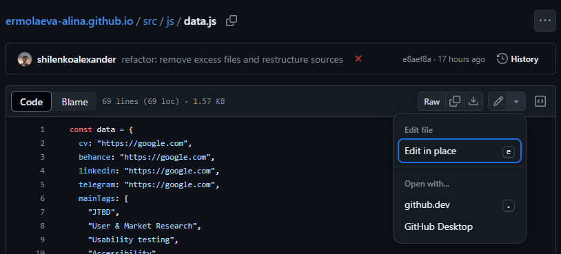
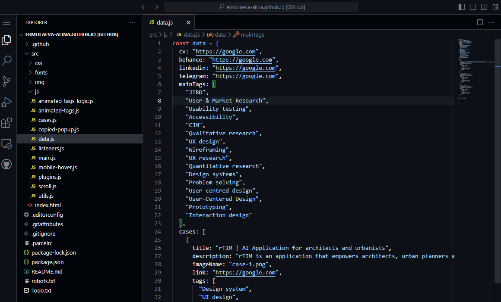
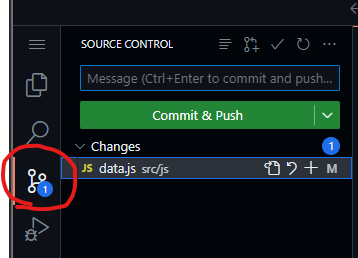
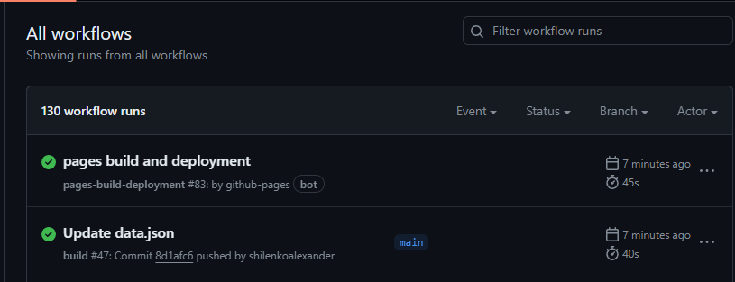

Значит смотри. Если у этих значков нет надписи на зеленом фоне `passing`, значит что-то пошло не так. Зови меня.
Сайт скорее всего работает, но просто какие-то данные не обновились.

Чтобы изменить какие-нибудь данные типа ссылок, кейсов, контактов, набора тегов - надо зайти в файл `src/js/data.js` и
изменить там данные.

Это можно сделать вот тут. Любой вариант подойдет, но github.dev удобнее.

Тут меняешь что тебе нужно. **Важно сохранить правильный синтаксис.**

Слева выбираешь этот пункт, и вводишь какое то сообщение, типа `Update data.js`.

Потом нажимаешь на кнопку `Commit & Push`. Изменения начали заливаться на сайт.

Чтобы проверить статус можно зайти [сюда](https://github.com/ermolaeva-alina/ermolaeva-alina.github.io/actions)

Если что-то крутится-вертится, то еще в процессе.
Если последние две записи зеленые - то все успешно и изменения уже попали на сайт.
Например, вот так 
